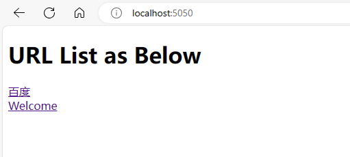
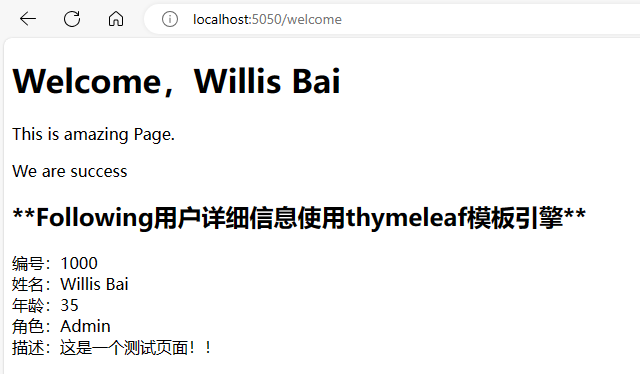

# BasicCoreJava

It seems like a Java tool, normally I will check in some code cases that I met when developing.
Here we go!

## Code Structure
com.example: common demos
com.web: web demos
com.szewec: the demos where I'm working on SZEWEC
com.objectiva: the demos where I'm working on Objectiva/Nagarro
com.beijingwujian: the demos where I'm working on BJWJ
                                                                         --Willis Bai

# 测试结果
## 测试类：com/beijingwujian/JavaLogDemo.java
### Mac OS Env测试结果：

### Windows Env测试结果：

## 作为SpringBoot项目运行，访问链接: http://localhost:5050/ ,测试效果如下：

## 作为SpringBoot项目运行，访问链接：http://localhost:5050/welcome ，测试结果如下：

